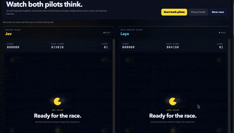

# Pacman AI Race

A browser-based maze chase experiment that runs TypeSafe AI's hosted Jev and self-hosted Laya side by side. Both pilots start from the same maze and receive the same full-board state and typed route choices. Each column exposes its own score, selected route, candidate probabilities, confidence, latency, metrics, and decision log.



## Local setup

Requirements: Node.js 20 or newer. Python 3.10 or newer is required only when running Laya locally.

1. Install the Node dependencies:

```sh
npm install
```

2. Create your local environment file:

```sh
cp .env.example .env
```

3. Open `.env` and configure the providers you want to use:

| Variable | Purpose |
| --- | --- |
| `TYPESAFE_API_KEY` | Jev API key from the [TypeSafe console](https://console.typesafe.ai/keys) |
| `TYPESAFE_MODEL` | Optional Jev model override; defaults to `jev-latest` |
| `LAYA_BASE_URL` | URL of the separately running Laya server |
| `LAYA_MODEL` | Laya checkpoint used in solo and comparison modes |
| `LAYA_API_KEY` | Optional key when the Laya server requires authentication |

You may configure Jev, Laya, or both. Manual mode works without either provider.

4. If you want to use Laya, install and start its self-hosted server in a second terminal:

```sh
python3 -m venv .laya-venv
.laya-venv/bin/python -m pip install "laya[serve]"
.laya-venv/bin/laya-serve
```

Leave Laya running. Its URL must match `LAYA_BASE_URL` in `.env`. The first launch downloads the model weights. The benchmark checks `english`, `multilingual`, and `typed-decisions`, so preloading those checkpoints is recommended when benchmarking. See the [official Laya repository](https://github.com/NandhaKishorM/laya) for model, device, and Docker configuration.

5. Start Pacman from the project directory:

```sh
npm start
```

`npm start` loads `.env` automatically. The API keys and Laya connection details stay on the local Node server and are never sent to browser storage or committed to Git.

Open:

- [http://localhost:4173](http://localhost:4173) — side-by-side Jev and Laya race
- [http://localhost:4173/pilot.html](http://localhost:4173/pilot.html) — solo AI or manual play
- [http://localhost:4173/benchmark.html](http://localhost:4173/benchmark.html) — repeatable model benchmark

## Side-by-side comparison

- Jev runs on the left and Laya runs on the right.
- The single **Start both pilots** control starts both independent simulations together.
- Each maze has its decision inspector directly underneath it. Continue scrolling for that pilot's whole-board state, route candidates, run metrics, and decision log.
- The two games never share scores, ghosts, routes, pending requests, or telemetry.
- Both simulations use the same deterministic ghost seed and simulation clock, so provider latency does not change the underlying ghost strategy.
- Comparison mode requires both providers to be ready. It clearly reports a missing Jev key or an unavailable Laya server before the race begins.

## How the AI pilots drive

- Before every decision, code builds a fresh whole-board snapshot containing the full maze, every remaining dot, Pacman's planned position and heading, every ghost's position and heading, lives, power timer, and recent path. The score stays in the UI and is not sent to the model because it does not change the best route.
- Jev receives that rich state unchanged. Laya alone receives a compact adapter with the same full maze, live actors, power timer, remaining-dot counts, and shorter route criteria so the request fits its smaller checkpoint contexts.
- The planner selects one real remaining dot from the full maze as a committed target. That target stays fixed until collected; every route tells the model whether it reaches the target, moves closer, makes no progress, or detours away. Remaining-dot counts by region are included explicitly, so final dots cannot disappear inside the raw map representation.
- Route safety timing includes Pacman's pause on every regular and power dot. This prevents a route from being labelled safe using open-corridor speed while ghosts continue moving during food collection.
- A normal ghost is fatal from every direction, including when Pacman catches it from behind. Both provider prompts say this explicitly; only a still-frightened ghost is edible.
- Level-one movement follows the arcade-style ratio: Pacman moves at 80% base speed and normal ghosts at 75%, but Pacman pauses briefly for every dot and longer for a power dot. That means a small empty-corridor advantage exists, but ordinary dot eating usually makes Pacman slower overall and never makes dangerous contact safe.
- Code runs a deterministic fixed-step simulation of Pacman, food pauses, power mode, and the real ghost targeting rules for every legal route. The bounded search looks three junction decisions ahead (up to 240 search nodes), filters simulated-fatal routes whenever any full-horizon survivor exists, and ranks the survivors lexicographically rather than allowing food value to outweigh death.
- Before each planned route begins, the local server sends compact structured route summaries and one typed `choice` question through the official `@typesafe-ai/sdk`.
- The selected provider receives routes beginning with every walkable direction at that junction, including reverse/U-turn options. The state also lists blocked directions explicitly so the omission is never ambiguous.
- U-turns remain available. Repetition is considered only after survival, continuation, escape, power, and food facts. The game never replaces the provider's returned route.
- The selected provider is the only route chooser in AI mode. Pacman executes its complete multi-tile route while the next route is prefetched, avoiding a network wait on every tile.
- If a prefetched answer is still late at the route endpoint, the world briefly holds there until the selected provider responds; no local safety route is substituted.
- Failed requests are shown and retried. They never create a `Local safety` entry in the decision log.
- The model can return only a supplied route ID. The server validates that invariant before the browser acts.
- Pacman executes only the selected immediate corridor and replans at the next junction. Prefetch starts from a simulated projection of the remaining active corridor, including concurrent ghost movement; a materially mismatched arrival snapshot invalidates the prefetched answer.
- Pacman, ghosts, timers, and collisions keep moving while the next route is planned.
- The telemetry view shows the live whole-maze food map, complete structured state, route criteria, route probabilities, usage, latency, and a ten-decision trace. It does not invent chain-of-thought text that neither provider returns.

Reference: [TypeSafe JavaScript SDK](https://docs.typesafe.ai/sdk/javascript) and [Choice primitive](https://docs.typesafe.ai/primitives/choice).

## Controls

- Arrow keys or `WASD`: move exactly one tile per press; holding a key does not auto-run
- `P` or Space: pause/resume
- On small screens, use the on-screen direction pad

## Development

After installing dependencies, run all checks with:

```sh
npm run check
```

Use `npm test` for a single test run or `npm run test:watch` while developing. The repository is organized by runtime boundary:

```text
public/                 Browser entry pages and styles
  styles/               Page-specific CSS
src/
  client/               Browser controllers and UI behavior
  shared/               Game, planning, and reporting modules shared by runtimes
  server/               HTTP/API entry point and AI provider adapters
    providers/          Jev/Laya integrations and provider validation
  tools/                Developer utilities and offline benchmarks
test/                   Node test suite
```

Only `public/`, `src/client/`, and `src/shared/` are served to the browser. Server modules, environment files, tests, and package metadata remain outside the web root.

Run the fixed-seed, two-level, active-ghost benchmark without provider credentials with `npm run benchmark:offline`. It reports highest level, clears, deaths, dots, decisions, forecast mismatches, search time, and forced-danger states for both a legacy-style immediate-food policy and the safety-first rank-one policy. Simulation advances in fixed time steps and never uses wall-clock timing for game state.

The game is built with semantic HTML, modern CSS, Canvas, JavaScript modules, and TypeSafe AI's official SDK. Jev and Laya have separate provider adapters, while sharing only payload validation and response normalization. Core maze rules, next-junction route simulation, decision-state preparation, benchmark aggregation, server validation, and response handling are tested independently of the browser. Tests use fake clients and never spend API credits or load local model weights.
